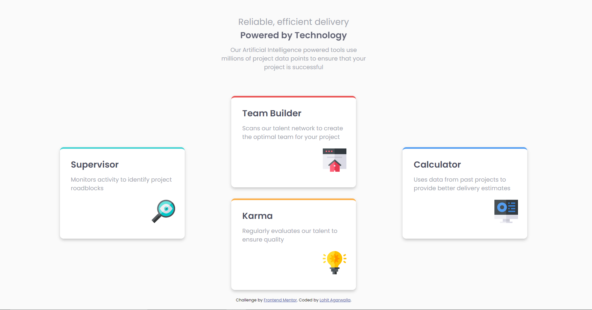
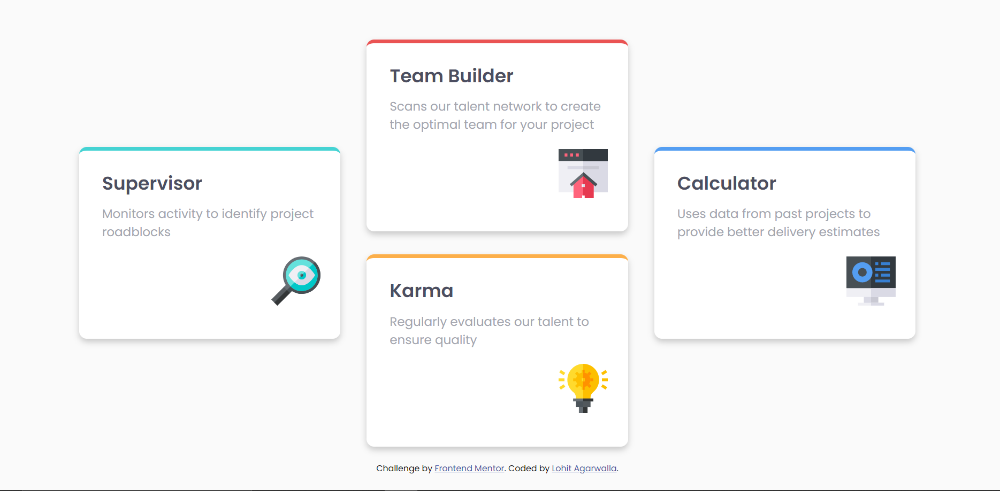

# Frontend Mentor - Four card feature section solution

### Screenshot

This is a solution to the [Four card feature section challenge on Frontend Mentor](https://www.frontendmentor.io/solutions/fourcardfeaturesection-using-css-variables-flexbox-and-media-queries-ErONOOjqX). Frontend Mentor challenges help you improve your coding skills by building realistic projects. 

## Table of contents

- [Overview](#overview)
  - [The challenge](#the-challenge)
  - [Links](#links)
- [My process](#my-process)
  - [Built with](#built-with)
  - [What I learned](#what-i-learned)
  - [Continued development](#continued-development)
- [Author](#author)

## Overview

### The challenge

Users should be able to:

- View the optimal layout for the site depending on their device's screen size

### Links

- Solution URL: (https://github.com/imlohit/Frontendmentor_challenges/tree/main/Four-card-feature-section)
- Live Site URL: (https://gracious-kalam-87bbe1.netlify.app/)

## My process

### Built with

- Semantic HTML5 markup
- CSS custom properties
- Flexbox
- Media queries
- Mobile-first-workflow

### What I learned

For the first time before starting the project, I sketched a Rough drawing of the project on a piece of paper and straightaway I started seeing the results. I was better prepared this time to tackle the mobile first workflow and easily used flexbox in media queries to make it desktop responsive. I completed the project a lot quicker too compared to previous projects. Definitely going to implement this drawing habit for all my future projects. 

### Continued development

There were many repeated piece of codes in my project. I can use Sass to minimise the repeatation. Will try to include sass in my future project.

## Author

- Frontend Mentor - [@imlohit](https://www.frontendmentor.io/profile/imlohit)

