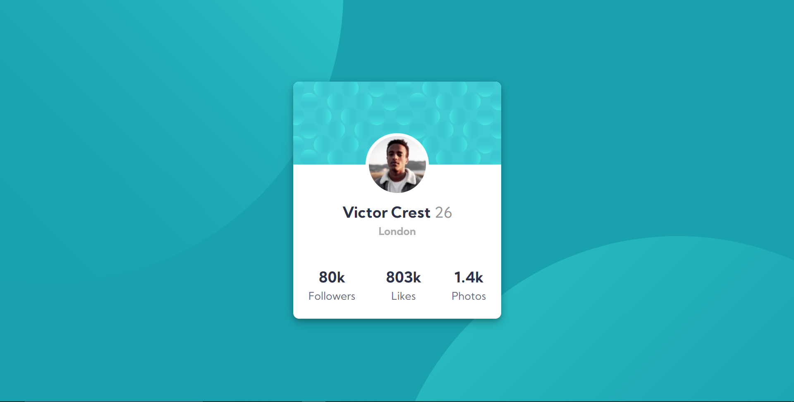

# Frontend Mentor - Profile card component solution

### Screenshot

### Links

- Solution URL: (https://www.frontendmentor.io/solutions/profilecard-using-css-variables-flexbox-and-position-property-YtCO-vvBo)
- Live Site URL: (https://nervous-kalam-122647.netlify.app/)

### The challenge

The challenge is to build out this profile card component and get it looking as close to the design as possible.

You can use any tools you like to help you complete the challenge. So if you've got something you'd like to practice, feel free to give it a go.

### Built with

- Semantic HTML5 markup
- CSS custom properties
- Flexbox
- position property

### What I learned

-The major difficulty I faced in this project was to properly place the profile image. I had to use the help of google and then experiment and apply position property. Also the overflow:hidden property helped in setting border-radius in top properly. I have to admit before starting this project I took it lightly and thought it was walk in the park. But I was wrong, the image part proved to be quite tricky. Atleast now I feel a lot better using position property than before. I also applied CSS variables in this project which i learned recently. It will be very useful in bigger projects.  

### Continued development

- Practice,Practice and Practice CSS
- Planning to learn and use Sass in future projects

## Author

- Frontend Mentor - [@imlohit](https://www.frontendmentor.io/profile/imlohit)

