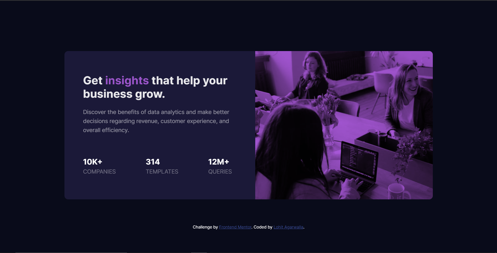

# Frontend Mentor - Stats preview card component solution

### Screenshot

This is a solution to the [Stats preview card component challenge on Frontend Mentor](https://www.frontendmentor.io/solutions/completed-using-scss-flexbox-and-media-queries-X-lXoSwJ2). Frontend Mentor challenges help you improve your coding skills by building realistic projects. 

## Table of contents

- [Overview](#overview)
  - [The challenge](#the-challenge)
  - [Links](#links)
- [My process](#my-process)
  - [Built with](#built-with)
  - [What I learned](#what-i-learned)
  - [Continued development](#continued-development)
- [Author](#author)

## Overview

### The challenge

The challenge is to build out this card component and get it looking as close to the design as possible.

You can use any tools you like to help you complete the challenge. So if you've got something you'd like to practice, feel free to give it a go.

Your users should be able to:

- View the optimal layout depending on their device's screen size

### Links

- Solution URL: https://github.com/imlohit/Frontendmentor_challenges/tree/main/stats-preview-card-component
- Live Site URL: https://app.netlify.com/sites/practical-bose-fff9d7/overview

## My process

### Built with

- Semantic HTML5 markup
- SCSS
- Flexbox
- Media Queries
- VsCode
- Mobile-first workflow

*
### What I learned

Use this section to recap over some of your major learnings while working through this project. Writing these out and providing code samples of areas you want to highlight is a great way to reinforce your own knowledge.

### Continued development

Use this section to outline areas that you want to continue focusing on in future projects. These could be concepts you're still not completely comfortable with or techniques you found useful that you want to refine and perfect.

## Author

- Frontend Mentor - [https://www.frontendmentor.io/profile/imlohit]

